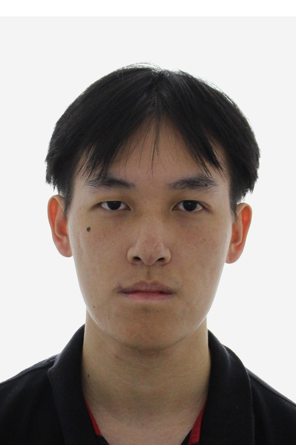

We are a team based in the [School of Computing, National University of Singapore](https://www.comp.nus.edu.sg).

You can reach us at the email `seer[at]comp.nus.edu.sg`

## Project team

### Jarell Liaw

[[github](https://github.com/liawjarell)]

* Role: Team Lead, Developer
* Responsibilities: Deliverables and Deadlines

### Mai Kai Ler

[[github](https://github.com/kailermai)]

* Role: Developer
* Responsibilities: Documentation

### Jarret Phon

[[github](http://github.com/jarretphon)]

* Role: Developer
* Responsibilities: Testing

### Jerry Toh

[[github](http://github.com/Jerrytys)]

* Role: Developer
* Responsibilities: Code Quality

### Li Qingrui

[[github](http://github.com/lqr1019)]

* Role: Developer
* Responsibilities: Storage, Integration
