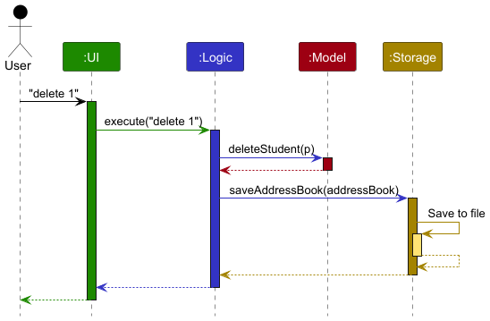
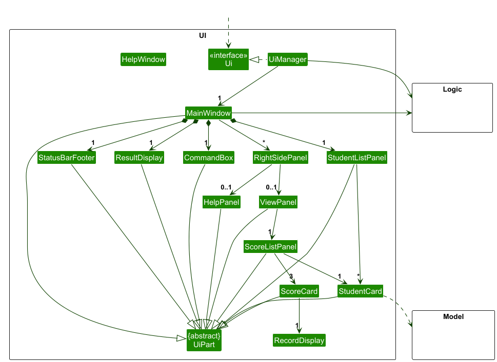
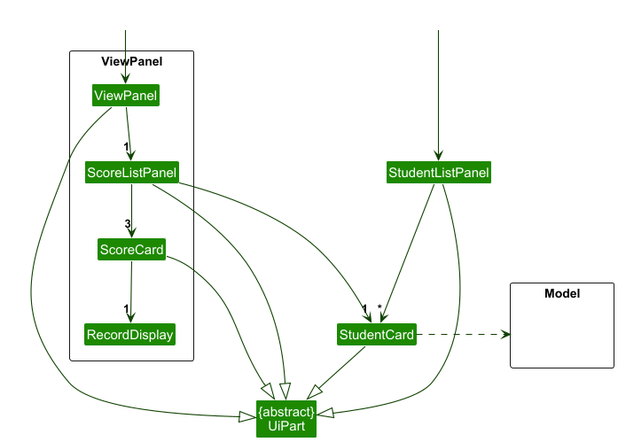
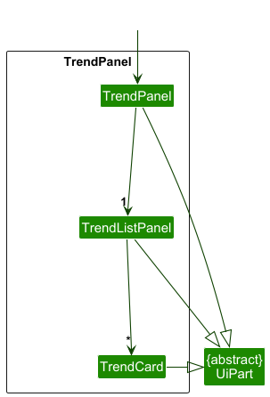
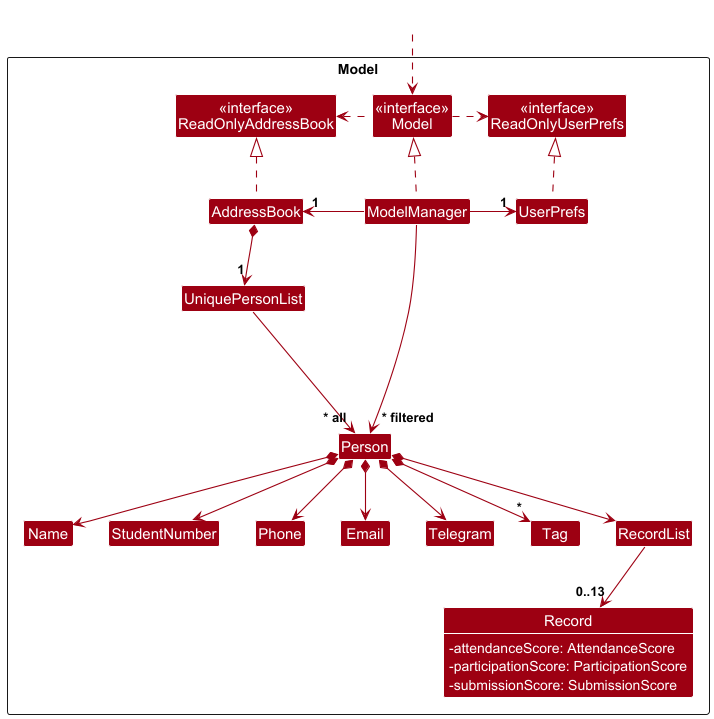
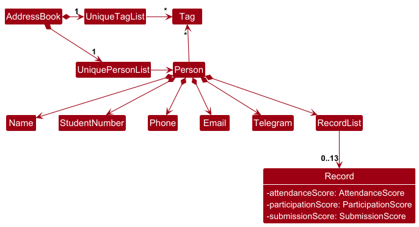
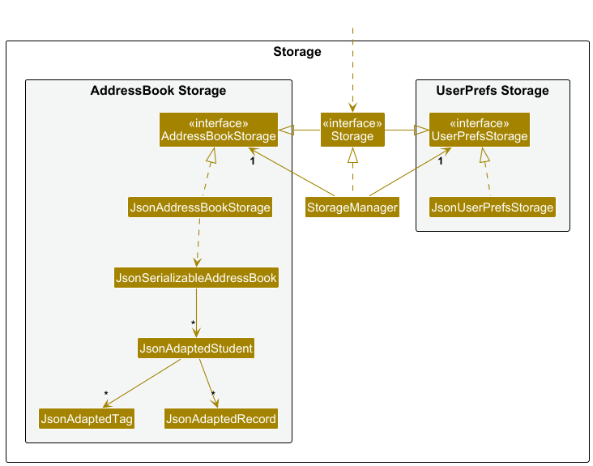

* Table of Contents
{:toc}

--------------------------------------------------------------------------------------------------------------------

## **Acknowledgements**

* {list here sources of all reused/adapted ideas, code, documentation, and third-party libraries -- include links to the original source as well}

--------------------------------------------------------------------------------------------------------------------

## **Setting up, getting started**

Refer to the guide [_Setting up and getting started_](SettingUp.md).

--------------------------------------------------------------------------------------------------------------------

## **Design**

:bulb: **Tip:** The `.puml` files used to create diagrams are in this document `docs/diagrams` folder. Refer to the [_PlantUML Tutorial_ at se-edu/guides](https://se-education.org/guides/tutorials/plantUml.html) to learn how to create and edit diagrams.

### Architecture

The ***Architecture Diagram*** given above explains the high-level design of the App.

Given below is a quick overview of main components and how they interact with each other.

**Main components of the architecture**

**`Main`** (consisting of classes [`Main`](https://github.com/se-edu/addressbook-level3/tree/master/src/main/java/seedu/address/Main.java) and [`MainApp`](https://github.com/se-edu/addressbook-level3/tree/master/src/main/java/seedu/address/MainApp.java)) is in charge of the app launch and shut down.
* At app launch, it initializes the other components in the correct sequence, and connects them up with each other.
* At shut down, it shuts down the other components and invokes cleanup methods where necessary.

The bulk of the app's work is done by the following four components:

* [**`UI`**](#ui-component): The UI of the App.
* [**`Logic`**](#logic-component): The command executor.
* [**`Model`**](#model-component): Holds the data of the App in memory.
* [**`Storage`**](#storage-component): Reads data from, and writes data to, the hard disk.

[**`Commons`**](#common-classes) represents a collection of classes used by multiple other components.

**How the architecture components interact with each other**

The *Sequence Diagram* below shows how the components interact with each other for the scenario where the user issues the command `delete 1`.

Each of the four main components (also shown in the diagram above),

* defines its *API* in an `interface` with the same name as the Component.
* implements its functionality using a concrete `{Component Name}Manager` class (which follows the corresponding API `interface` mentioned in the previous point.

For example, the `Logic` component defines its API in the `Logic.java` interface and implements its functionality using the `LogicManager.java` class which follows the `Logic` interface. Other components interact with a given component through its interface rather than the concrete class (reason: to prevent outside component's being coupled to the implementation of a component), as illustrated in the (partial) class diagram below.

The sections below give more details of each component.

### UI component

The **API** of this component is specified in [`Ui.java`](https://github.com/se-edu/addressbook-level3/tree/master/src/main/java/seedu/address/ui/Ui.java)

The UI consists of a `MainWindow` that is made up of parts e.g.`CommandBox`, `ResultDisplay`, `StudentListPanel`, `StatusBarFooter` etc. All these, including the `MainWindow`, inherit from the abstract `UiPart` class which captures the commonalities between classes that represent parts of the visible GUI.

The `UI` component uses the JavaFx UI framework. The layout of these UI parts are defined in matching `.fxml` files that are in the `src/main/resources/view` folder. For example, the layout of the [`MainWindow`](https://github.com/se-edu/addressbook-level3/tree/master/src/main/java/seedu/address/ui/MainWindow.java) is specified in [`MainWindow.fxml`](https://github.com/se-edu/addressbook-level3/tree/master/src/main/resources/view/MainWindow.fxml)

The `UI` component,

* executes user commands using the `Logic` component.
* listens for changes to `Model` data so that the UI can be updated with the modified data.
* keeps a reference to the `Logic` component, because the `UI` relies on the `Logic` to execute commands.
* depends on some classes in the `Model` component, as it displays `Student` object residing in the `Model`.

#### ViewPanel Component

The `ViewPanel` consists of a `ScoreListPanel` that is made up of parts e.g.`ScoreCard`, `StudentCard`, etc. All these, including the `ScoreListPanel`, inherit from the abstract `UiPart`.

The `ViewPanel` component,
* displays the scores of a student in the `Model`.

#### TrendPanel Component

The `TrendPanel` consists of a `TrendListPanel` that is made up of `TrendCard`. All these, including the `TrendListPanel`, inherit from the abstract `UiPart`.

The `TrendPanel` component,
* displays the trend of the class in the `Model`.

### Logic component

**API** : [`Logic.java`](https://github.com/se-edu/addressbook-level3/tree/master/src/main/java/seedu/address/logic/Logic.java)

Here's a (partial) class diagram of the `Logic` component:

The sequence diagram below illustrates the interactions within the `Logic` component, taking `execute("delete 1")` API call as an example.

:information_source: **Note:** The lifeline for `DeleteCommandParser` should end at the destroy marker (X) but due to a limitation of PlantUML, the lifeline continues till the end of diagram.

How the `Logic` component works:

1. When `Logic` is called upon to execute a command, it is passed to an `AddressBookParser` object which in turn creates a parser that matches the command (e.g., `DeleteCommandParser`) and uses it to parse the command.
1. This results in a `Command` object (more precisely, an object of one of its subclasses e.g., `DeleteCommand`) which is executed by the `LogicManager`.
1. The command can communicate with the `Model` when it is executed (e.g. to delete a student). 
   Note that although this is shown as a single step in the diagram above (for simplicity), in the code it can take several interactions (between the command object and the `Model`) to achieve.
1. The result of the command execution is encapsulated as a `CommandResult` object which is returned back from `Logic`.

Here are the other classes in `Logic` (omitted from the class diagram above) that are used for parsing a user command:

How the parsing works:
* When called upon to parse a user command, the `AddressBookParser` class creates an `XYZCommandParser` (`XYZ` is a placeholder for the specific command name e.g., `AddCommandParser`) which uses the other classes shown above to parse the user command and create a `XYZCommand` object (e.g., `AddCommand`) which the `AddressBookParser` returns back as a `Command` object.
* All `XYZCommandParser` classes (e.g., `AddCommandParser`, `DeleteCommandParser`, ...) inherit from the `Parser` interface so that they can be treated similarly where possible e.g, during testing.

### Model component
**API** : [`Model.java`](https://github.com/se-edu/addressbook-level3/tree/master/src/main/java/seedu/address/model/Model.java)

The `Model` component,

* stores the address book data i.e., all `Student` objects (which are contained in a `UniqueStudentList` object).
* stores the currently 'selected' `Student` objects (e.g., results of a search query) as a separate _filtered_ list which is exposed to outsiders as an unmodifiable `ObservableList<Student>` that can be 'observed' e.g. the UI can be bound to this list so that the UI automatically updates when the data in the list change.
* stores a `UserPref` object that represents the user’s preferences. This is exposed to the outside as a `ReadOnlyUserPref` objects.
* does not depend on any of the other three components (as the `Model` represents data entities of the domain, they should make sense on their own without depending on other components)

:information_source: **Note:** An alternative (arguably, a more OOP) model is given below. It has a `Tag` list in the `AddressBook`, which `Student` references. This allows `AddressBook` to only require one `Tag` object per unique tag, instead of each `Student` needing their own `Tag` objects. 

### Storage component

**API** : [`Storage.java`](https://github.com/se-edu/addressbook-level3/tree/master/src/main/java/seedu/address/storage/Storage.java)

The `Storage` component,
* can save both address book data and user preference data in JSON format, and read them back into corresponding objects.
* inherits from both `AddressBookStorage` and `UserPrefStorage`, which means it can be treated as either one (if only the functionality of only one is needed).
* depends on some classes in the `Model` component (because the `Storage` component's job is to save/retrieve objects that belong to the `Model`)

### Common classes

Classes used by multiple components are in the `seedu.address.commons` package.

--------------------------------------------------------------------------------------------------------------------

## **Implementation**

This section describes some noteworthy details on how certain features are implemented.

### \[Proposed\] Undo/redo feature

#### Proposed Implementation

The proposed undo/redo mechanism is facilitated by `VersionedAddressBook`. It extends `AddressBook` with an undo/redo history, stored internally as an `addressBookStateList` and `currentStatePointer`. Additionally, it implements the following operations:

* `VersionedAddressBook#commit()` — Saves the current address book state in its history.
* `VersionedAddressBook#undo()` — Restores the previous address book state from its history.
* `VersionedAddressBook#redo()` — Restores a previously undone address book state from its history.

These operations are exposed in the `Model` interface as `Model#commitAddressBook()`, `Model#undoAddressBook()` and `Model#redoAddressBook()` respectively.

Given below is an example usage scenario and how the undo/redo mechanism behaves at each step.

Step 1. The user launches the application for the first time. The `VersionedAddressBook` will be initialized with the initial address book state, and the `currentStatePointer` pointing to that single address book state.

Step 2. The user executes `delete 5` command to delete the 5th student in the address book. The `delete` command calls `Model#commitAddressBook()`, causing the modified state of the address book after the `delete 5` command executes to be saved in the `addressBookStateList`, and the `currentStatePointer` is shifted to the newly inserted address book state.

Step 3. The user executes `add n/David …​` to add a new student. The `add` command also calls `Model#commitAddressBook()`, causing another modified address book state to be saved into the `addressBookStateList`.

:information_source: **Note:** If a command fails its execution, it will not call `Model#commitAddressBook()`, so the address book state will not be saved into the `addressBookStateList`.

Step 4. The user now decides that adding the student was a mistake, and decides to undo that action by executing the `undo` command. The `undo` command will call `Model#undoAddressBook()`, which will shift the `currentStatePointer` once to the left, pointing it to the previous address book state, and restores the address book to that state.

:information_source: **Note:** If the `currentStatePointer` is at index 0, pointing to the initial AddressBook state, then there are no previous AddressBook states to restore. The `undo` command uses `Model#canUndoAddressBook()` to check if this is the case. If so, it will return an error to the user rather
than attempting to perform the undo.

The following sequence diagram shows how an undo operation goes through the `Logic` component:

:information_source: **Note:** The lifeline for `UndoCommand` should end at the destroy marker (X) but due to a limitation of PlantUML, the lifeline reaches the end of diagram.

Similarly, how an undo operation goes through the `Model` component is shown below:

The `redo` command does the opposite — it calls `Model#redoAddressBook()`, which shifts the `currentStatePointer` once to the right, pointing to the previously undone state, and restores the address book to that state.

:information_source: **Note:** If the `currentStatePointer` is at index `addressBookStateList.size() - 1`, pointing to the latest address book state, then there are no undone AddressBook states to restore. The `redo` command uses `Model#canRedoAddressBook()` to check if this is the case. If so, it will return an error to the user rather than attempting to perform the redo.

Step 5. The user then decides to execute the command `list`. Commands that do not modify the address book, such as `list`, will usually not call `Model#commitAddressBook()`, `Model#undoAddressBook()` or `Model#redoAddressBook()`. Thus, the `addressBookStateList` remains unchanged.

Step 6. The user executes `clear`, which calls `Model#commitAddressBook()`. Since the `currentStatePointer` is not pointing at the end of the `addressBookStateList`, all address book states after the `currentStatePointer` will be purged. Reason: It no longer makes sense to redo the `add n/David …​` command. This is the behavior that most modern desktop applications follow.

The following activity diagram summarizes what happens when a user executes a new command:

#### Design considerations:

**Aspect: How undo & redo executes:**

* **Alternative 1 (current choice):** Saves the entire address book.
  * Pros: Easy to implement.
  * Cons: May have performance issues in terms of memory usage.

* **Alternative 2:** Individual command knows how to undo/redo by
  itself.
  * Pros: Will use less memory (e.g. for `delete`, just save the student being deleted).
  * Cons: We must ensure that the implementation of each individual command are correct.

_{more aspects and alternatives to be added}_

### \[Proposed\] Data archiving

_{Explain here how the data archiving feature will be implemented}_

--------------------------------------------------------------------------------------------------------------------

## **Documentation, logging, testing, configuration, dev-ops**

* [Documentation guide](Documentation.md)
* [Testing guide](Testing.md)
* [Logging guide](Logging.md)
* [Configuration guide](Configuration.md)
* [DevOps guide](DevOps.md)

--------------------------------------------------------------------------------------------------------------------

## **Appendix: Requirements**

### Product scope

**Target user profile**: Computer Science (CS) Teaching Assistants (TA) who are managing a small tutorial group, 
with many student related components to keep track of.

* has a need to manage a small number of students
* prefer desktop apps over other types
* can type fast
* prefers typing to mouse interactions
* is reasonably comfortable using CLI apps

**Value proposition**: Help TAs efficiently manage student contacts, track participation, and monitor submissions, 
providing a simple text based interface optimised for users to prefer Command Line Interface (CLI).

### User stories

Priorities: High (must have) - `* * *`, Medium (nice to have) - `* *`, Low (unlikely to have) - `*`

| Priority | As a …​                                     | I want to …​                                                           | So that I can…​                                                   |
|----------|---------------------------------------------|------------------------------------------------------------------------|-------------------------------------------------------------------|
| `* * *`  | TA who is using this app for the first time | see an overview of all the functionalities of TAHub                    |                                                                   |
| `* * *`  | TA                                          | add students to TAHub                                                  | start organising them before tutorial starts                      |
| `* * *`  | TA                                          | keep track of each student's school email                              |                                                                   |
| `* * *`  | TA                                          | keep track of each student's telegram handle                           |                                                                   |
| `* * *`  | TA                                          | keep track of each student's year and major                            |                                                                   |
| `* * *`  | TA                                          | remove students who are not part of my class                           | see only existing students in my record                           |
| `* * *`  | TA                                          | record attendance during tutorials                                     | fairly track each student's attendance                            |
| `* * *`  | TA                                          | record participation during tutorials                                  | fairly track each student's contributions                         |
| `* * *`  | TA                                          | use short and intuitive commands                                       | update records quickly during a busy tutorial session             |
| `* * *`  | TA                                          | record whether each student submitted their weekly task                | monitor consistency and identify students who are falling behind  |
| `* * *`  | TA                                          | view attendance/participation records of each student                  | monitor the participation level of each student over the semester |
| `* * *`  | TA                                          | view the attendance/participation records of all the students in TAHub | identify students who are lagging behind tutorials                |
| `* * *`  | TA                                          | mark students who are not present with valid reasons as excused        | track student attendance more easily                              |
| `* *`    | TA                                          | view trends                                                            | identify students who need extra support                          |
| `* *`    | TA                                          | redo/undo recent actions                                               | correct mistakes easily                                           |
| `* *`    | TA                                          | sort the students displayed by attendance/participation record         | see who are the students who need the most assistance             |
| `* *`    | TA                                          | search for students by partial name or email                           | quickly find the right Student                                     |
| `*`      | TA                                          | export data                                                            | provide evidence of student participation for grading             |
| `*`      | TA                                          | lock the participation records from further edits                      | accidental edits will not happen after it has been finalised      |
| `*`      | TA                                          | filter students who have low attendance/participation records          | easily find the students who need extra guidance                  |
| `*`      | TA                                          | view my students in alphabetical order                                 | browse the list more easily                                       |

### Use cases

(For all use cases below, the **System** is the `TAHub` and the **Actor** is the `Teaching Assistant(TA)`, unless specified otherwise)

**Use case: UC01 Add a student**

**Guarantees:** A student’s entry is added to the class.

**MSS**

1. TA requests to add a student to the class.
2. TAHub adds the student’s entry and displays a success message.
    Use case ends.

**Extensions**

* 1a. TAHub detects an error in the entered command.
    * 1a1. TAHub displays an error message.
       Use case ends.

* 1b. TAHub detects a duplicate entry.
    * 1b1. TAHub notifies TA of duplicate entry. 
       Use case ends.

 
**Use case: UC02 Delete a student**

**Preconditions:** The student to be deleted has an existing entry in TAHub.

**Guarantees:** The student is deleted.

**MSS**

1. TA <u>lists entries (UC03)</u>.
2. TA requests to delete a student’s entry.
3. TAHub removes the student’s entry and displays a success message.
    Use case ends.

**Extensions**

* 2a.  TAHub detects an error in the entered command.
    * 2a1. TAHub displays an error message.
       Use case ends.

 
**Use case: UC03 List entries**

**Guarantees:** All student entries will be displayed.

**MSS**
1. TA requests to list entries.
2. TAHub displays the list of students.
    Use case ends.

**Extensions**
* 1a. TAHub detects an error in the entered command.
    * 1a1. TAHub displays an error message.
       Use case ends.
* 1b. There are no existing students entries in TAHub.
    * 1b1. TAHub notifies the user that there are no existing entries.
       Use case ends.

 
**Use case: UC04 Find student**

**Guarantees:** All student entries with matching names will be displayed.

**MSS**
1. TA requests to find students by name.
2. TAHub displays matching student entries.
    Use case ends.

**Extensions**
* 1a. TAHub detects an error in the entered command.
    * 1a1. TAHub displays an error message.
       Use case ends.
* 1b. There are no students that match the given name.
    * 1b1. TAHub notifies the user that no match is found.
       Use case ends.

 
**Use case: UC05 Clear Entries**

**Guarantees:** All student entries will be deleted.

**MSS**

1.  TA requests to clear entries.
2.  TAHub deletes all entries and displays a success message.
     Use case ends.

**Extensions**

* 1a. TAHub detects an error in the entered command.
  * 1a1. TAHub displays an error message.
     Use case ends.

* 1b. There are no existing entries in TAHub.

    * 1b1. TAHub notifies the user that there are no existing entries.
       Use case ends.

 
**Use case: UC06 Edit Student**

**Preconditions:** The student to be edited has an existing entry in TAHub.

**Guarantees:** The student's entry is edited.

**MSS**

1.  TA <u>lists entries (UC03)</u>.
2.  TA requests to edit a student's entry.
3.  TAHub edits the student's entry and displays a success message.
     Use case ends.

**Extensions**

* 2a. TAHub detects an error in the entered command.
    * 2a1. TAHub displays an error message.
       Use case ends.

* 2b. TAHub detects a duplicate student entry.
    * 2b1. TAHub notifies TA of duplicate entry.
       Use case ends.

 
**Use case: UC07 Show Commands**

**Guarantees**: TAHub displays command guide.

**MSS**

1.  TA requests to view command guide.
2.  TAHub displays command guide.
     Use case ends.

**Extensions**

* 1a. TAHub detects an error in the entered command.
    * 1a1. TAHub displays an error message.
       Use case ends.

 
**Use case: UC08 Exit TAHub**

**Preconditions:** TAHub is currently running.

**Guarantees:** TAHub closes.

**MSS**
1. TA requests to exit TAHub.
2. TAHub displays an exit message and closes.
 Use case ends.

**Extensions**
* 1a. TAHub detects an error in the entered command.
    * 1a1. TAHub displays an error message.
     Use case ends.

 
**Use case: UC09 Add student record**

**Preconditions:** The TA has already added the student to the class.

**Guarantees:** The record in the specified week is created for the correct student in the class.

**MSS**
1. TA <u>list entries UC03</u>.
2. TA requests to add a student record.
3. TAHub adds the record and displays a success message. 
 Use case ends.

**Extensions**
* 2a. TAHub detects an error in the entered command.
    * 2a1. TAHub displays an error message.
     Use case ends.
* 3a. TA realizes that he made an error in the added record.
    * 3a1. TA requests to <u>edit student record UC10</u>.
       Use case ends.
* 3b. TA decides to scrape record entirely.
    * 3b1. TA requests to <u>delete student record UC11</u>.
       Use case ends.

 
**Use case: UC10 Edit student record**

**Preconditions:** 
* The TA has already added the student to the class.
* The student has an existing record for the specified week.

**Guarantees:** The record in the specified week is updated for the correct student in the class.

**MSS**
1. TA <u>list entries UC03</u>.
2. TA requests to edit a student record.
3. TAHub updates the record and displays a success message.
    Use case ends.

**Extensions**
* 2a. TAHub detects an error in the entered command.
    * 2a1. TAHub displays an error message.
       Use case ends.
* 3a. TA decides to scrape record entirely.
    * 3a1. TA requests to <u>delete student record UC11</u>.
       Use case ends.

 
**Use case: UC11 Delete student record**

**Preconditions:**
* The TA has already added the student to the class.

**Guarantees:** The record in the specified week is deleted for the correct student in the class.

**MSS**
1. TA <u>list entries UC03</u>.
2. TA requests to delete a student record.
3. TAHub deletes the record and displays a success message.
    Use case ends.

**Extensions**
* 2a. TAHub detects an error in the entered command.
    * 2a1. TAHub displays an error message.
       Use case ends.
* 2b. The student has no existing record in the specified week.
    * 2b1. TAHub displays an error message.
       Use case ends.

 
**Use case: UC12 Generate individual student record report**

**Preconditions:** The TA has already added the student into the class.

**Guarantees:** A graphical summary of student records is generated.

**MSS**
1. TA <u>list entries UC03</u>.
2. TA requests to generate an individual student record report.
3. TAHub displays the individual student record.
    Use case ends.

**Extensions**
* 2a. TAHub detects an error in the entered command.
    * 2a1. TAHub displays an error message.
       Use case ends.
* 2b. The student has no existing records.
    * 2b1. TAHub displays an empty report with a note.
       Use case ends.

 
**Use case: UC13 Generate class record report**

**Preconditions:** The TA has students with existing records in the class.

**Guarantees:** A graphical summary of student records is generated.

**MSS**
1. TA requests to generate a class record report.
2. TAHub displays the class record report.
    Use case ends.

**Extensions**
* 1a. TAHub detects an error in the entered command.
    * 1a1. TAHub displays an error message.
       Use case ends.
* 1b. The class has no existing records.
    * 1b1. TAHub displays an empty report with a note.
       Use case ends.

 
**Use case: UC14 Sort students**

**Preconditions:** The TA has students in the class.

**Guarantees:** A sorted student list is generated.

**MSS**
1. TA requests to sort the students based on attendance / participation / submission.
2. TAHub displays the sorted student list.
    Use case ends.

**Extensions**
* 1a. TAHub detects an error in the entered command.
    * 1a1. TAHub displays an error message.
       Use case ends.
* 1b. The class has no existing students.
    * 1b1. TAHub displays an empty student list.
       Use case ends.

### Non-Functional Requirements

1.  Should work on any _mainstream OS_ as long as it has Java `17` or above installed.
2.  Should be able to hold up to 1000 Students without a noticeable sluggishness in performance for typical usage.
3.  A user with above-average typing speed for regular English text (i.e. not code, not system admin commands) should 
be able to accomplish most of the tasks faster using commands than using the mouse.
4.  Should be usable by a novice who has never used admin tracking platforms.
5.  The product does not cover communicating with contacts and submission/grading of assignments.
6.  The product should not lose any data when the application crashes or exits unexpectedly.

### Glossary

* **Mainstream OS**: Windows, Linux, Unix, MacOS
* **Command Line Interface (CLI)**: A CLI is a text-based user interface that allows users to interact with the 
application.
* **Teaching Assistant (TA)**: A TA is an educational professional who supports a certified teacher in the classroom by 
helping to deliver lessons, provide individualized student support, and manage classroom tasks.
* **Entry**: A student entity stored in TAHub. Each entry contains details related to the student, such as name, email,
telegram handle, year of study, and major.
* **Record**: A quantifiable piece of information linked to a student within a class. Examples include participation
score, attendance, and task submission history.
* **Class**: A class refers to all student entries and their associated records in TAHub.

--------------------------------------------------------------------------------------------------------------------

## **Appendix: Instructions for manual testing**

Given below are instructions to test the app manually.

:information_source: **Note:** These instructions only provide a starting point for testers to work on;
testers are expected to do more *exploratory* testing.

### Launch and shutdown

1. Initial launch

   1. Download the jar file and copy into an empty folder

   1. Double-click the jar file Expected: Shows the GUI with a set of sample contacts. The window size may not be optimum.

1. Saving window preferences

   1. Resize the window to an optimum size. Move the window to a different location. Close the window.

   1. Re-launch the app by double-clicking the jar file. 
       Expected: The most recent window size and location is retained.

1. _{ more test cases …​ }_

### Viewing help

### Adding a person

### Editing a student

### Adding/Editing a Student Record
1. **Adding a Student Record while all Students are being shown**

   1. **Prerequisites**: List all Students using the `list` command. Multiple Students in the list.
   
   2. **Test case**: `record 1 week/1 att/1 sub/1 part/1` 
      **Expected**: The record in week 1 for the student at index 1 is created with the given attendance, participation, and submission scores. Details of the added record is shown in the result display.
   
   3. **Test case**: `record 1 week/3 att/5 sub/1 part/1` 
      **Expected**: No record is created. An error message highlighting `ATTENDANCE_SCORE` constraints is shown in the result display.
   
   4. **Other incorrect record commands to try**: `record x week/1 att/1 sub/1 part/1` (where x is larger than list size), `record 1 week/1 sub/1 part/1` (missing `ATTENDANCE_SCORE`), `record 1 week/1 att/x sub/y part/z` where `x`, `y` and `z` are variations of invalid scores.

2. **Editing a Student Record while all Students are being shown**

   1. **Prerequisites**: There exists a student with existing record(s) in the class.
   
   2. **Test case**: `record x week/y att/1 sub/1 part/5` (where x is the index of the student and y is the index of the record to be edited) 
      **Expected**: The record in week y for the student at index x is edited with the given attendance, participation, and submission scores. Details of the edited record is shown in the result display.

   3. **Other incorrect record commands to try**: Refer to 1c and 1d 
      **Expected**: Similar to 1c and 1d
 

### Deleting a Student Record

1. **Deleting a Student Record while all Students are being shown**

   1. **Prerequisites**: There exists a student with existing record(s) in the class.
   2. **Test case**: `record x week/y` (where x is the index of the student and y is the index of the record to be deleted) 
      **Expected**: The record in week y for the student at index x is deleted. Details of the deleted record is shown in the result display.
   
   3. **Test case**: `record x week/z` (where x is the index of the student and z is a week number where no record exists) 
      **Expected**: No record is deleted. A helper message indicating that no record exists for the specified week is shown in the result display.
    

### Deleting a Student

1. Deleting a Student while all Students are being shown

   1. **Prerequisites**: List all Students using the `list` command. Multiple Students in the list.

   2. **Test case**: `delete 1` 
      **Expected**: First contact is deleted from the list. Details of the deleted contact shown in the status message. Timestamp in the status bar is updated.

   3. **Test case**: `delete 0` 
      **Expected**: No Student is deleted. Error details shown in the status message. Status bar remains the same.

   4. **Other incorrect delete commands to try**: `delete`, `delete x`, `...` (where x is larger than the list size) 
      **Expected**: Similar to previous.

1. _{ more test cases …​ }_

### Viewing student record

1. **Successful viewing of student record**

   1. **Prerequisites**: At least 1 Student listed in the student list panel on the left.
    
   2. **Test case**: `view 1`
      **Expected**: Right-hand panel is updated to display the record overview of the student at index 1, showing calculated record statistics. Status message shows the success message: Viewing record of Student: [Student]. 

2. **Viewing student record with invalid index**

   1. **Prerequisites**: At least 1 Student listed in the student list panel on the left.
    
   2. **Test case**: `view 0` or `view x` (where x is larger than the list size) 
      **Expected**: Right-hand panel remains unchanged. Error details shown in the status message.

### Viewing overall trend of all student records

1. **Successful viewing of overall trend with Student records present**

   1. **Prerequisites**: At least 1 Student listed in the student list panel on the left.
    
   2. **Test case**: `trend` 
      **Expected**: Right-hand panel is updated to display the trend overview, showing calculated record statistics for all students. Status message shows the success message: Opened trend window.

2. **Viewing trend with no Student records present**

   1. **Prerequisites**: No students listed in the student list panel on the left.

   2. **Test case**: `trend` 
      **Expected**: Right-hand panel is updated to display an empty panel. Status message shows the success message: Opened trend window.

### Sorting students

### Saving data

1. Dealing with missing/corrupted data files

   1. _{explain how to simulate a missing/corrupted file, and the expected behavior}_

1. _{ more test cases …​ }_
