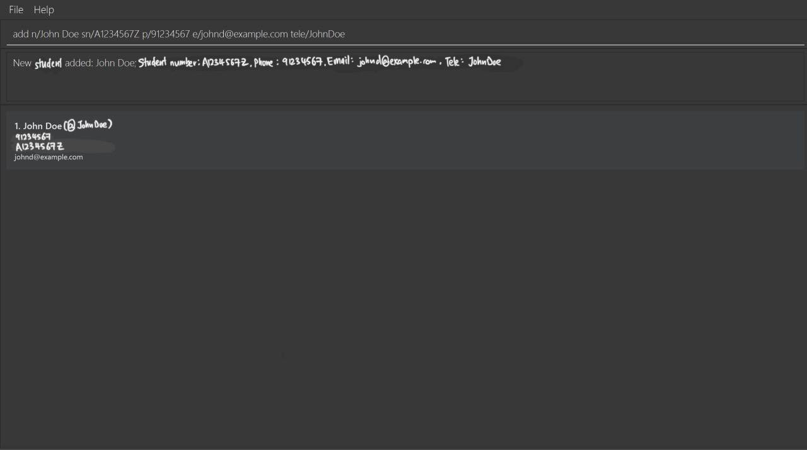
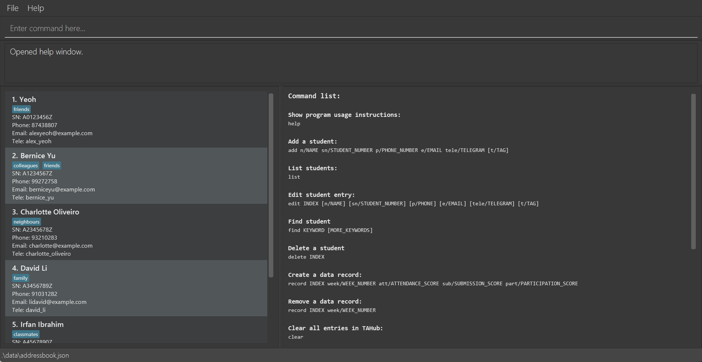
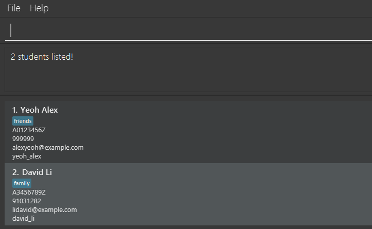

TAHub is a **desktop app for Teaching Assistants to manage students, optimized for use via a Command Line Interface** (CLI) while still having the benefits of a Graphical User Interface (GUI). If you can type fast, TAHub can get your student management tasks done faster than traditional GUI apps.

* Table of Contents
{:toc}

--------------------------------------------------------------------------------------------------------------------

## Quick start

1. Ensure you have Java `17` or above installed in your Computer. 
   **Mac users:** Ensure you have the precise JDK version prescribed [here](https://se-education.org/guides/tutorials/javaInstallationMac.html).

1. Download the latest `.jar` file from [here](https://github.com/AY2526S1-CS2103T-T16-2/tp/releases).

1. Copy the file to the folder you want to use as the _home folder_ for your TAHub.

1. Open a command terminal, `cd` into the folder you put the jar file in, and use the `java -jar tahub.jar` command to run the application. 
   A GUI similar to the below should appear in a few seconds. Note how the app contains some sample data. 
   

1. Type the command in the command box and press Enter to execute it. e.g. typing **`help`** and pressing Enter will open the help window. 
   Some example commands you can try:

   * `list` : Lists all students.

   * `add n/John Doe sn/A1234567J p/98765432 e/johnd@example.com tele/john_doe` : Adds a student named `John Doe` to TAHub.

   * `delete 3` : Deletes the 3rd student shown in the current list.

   * `clear` : Deletes all students.

   * `exit` : Exits the app.

1. Refer to the [Features](#features) below for details of each command.

--------------------------------------------------------------------------------------------------------------------

## Features

**:information_source: Notes about the command format:** 

* Words in `UPPER_CASE` are the parameters to be supplied by the user. 
  e.g. in `add n/NAME`, `NAME` is a parameter which can be used as `add n/John Doe`.

* Items in square brackets are optional. 
  e.g `n/NAME [t/TAG]` can be used as `n/John Doe t/friend` or as `n/John Doe`.

* Items with `…`​ after them can be used multiple times including zero times. 
  e.g. `[t/TAG]…​` can be used as ` ` (i.e. 0 times), `t/friend`, `t/friend t/family` etc.

* Parameters can be in any order. 
  e.g. if the command specifies `n/NAME p/PHONE_NUMBER`, `p/PHONE_NUMBER n/NAME` is also acceptable.

* Extraneous parameters for commands that do not take in parameters (such as `help`, `list`, `exit` and `clear`) will be ignored. 
  e.g. if the command specifies `help 123`, it will be interpreted as `help`.

* If you are using a PDF version of this document, be careful when copying and pasting commands that span multiple lines as space characters surrounding line-breaks may be omitted when copied over to the application.

### Viewing help : `help`

Shows a message explaining how to access the help page.

Format: `help`

### Adding a person: `add`

Adds a person to TAHub.

Format: `add n/NAME sn/STUDENT_NUMBER p/PHONE_NUMBER e/EMAIL tele/TELEGRAM [t/TAG]…​`

:bulb: **Tip:**
A person can have any number of tags (including 0)

Examples:
* `add n/John Doe sn/A0123456Z p/98765432 e/johnd@example.com tele/john_doe`
* `add n/Betsy Crowe t/friend e/betsycrowe@example.com tele/betsy_crowe sn/A1234567G p/1234567 t/criminal`

### Listing all students : `list`

Shows a list of all students in TAHub.

Format: `list`

### Editing a student : `edit`

Edits an existing student in TAHub.

Format: `edit INDEX [n/NAME] [sn/STUDENT_NUMBER] [p/PHONE] [e/EMAIL] [tele/TELEGRAM] [t/TAG]…​`

* Edits the student at the specified `INDEX`. The index refers to the index number shown in the displayed student list. The index **must be a positive integer** 1, 2, 3, …​
* At least one of the optional fields must be provided.
* Existing values will be updated to the input values.
* When editing tags, the existing tags of the student will be removed i.e adding of tags is not cumulative.
* You can remove all the student’s tags by typing `t/` without
    specifying any tags after it.

Examples:
*  `edit 1 p/91234567 e/johndoe@example.com` Edits the phone number and email address of the 1st student to be `91234567` and `johndoe@example.com` respectively.
*  `edit 2 n/Betsy Crower t/` Edits the name of the 2nd student to be `Betsy Crower` and clears all existing tags.

### Locating students by name: `find`

Finds persons whose names contain any of the given keywords.

Format: `find KEYWORD [MORE_KEYWORDS]`

* The search is case-insensitive. e.g `hans` will match `Hans`
* The order of the keywords does not matter. e.g. `Hans Bo` will match `Bo Hans`
* Only the name is searched.
* Only full words will be matched e.g. `Han` will not match `Hans`
* Persons matching at least one keyword will be returned (i.e. `OR` search).
  e.g. `Hans Bo` will return `Hans Gruber`, `Bo Yang`

Examples:
* `find John` returns `john` and `John Doe`
* `find alex david` returns `Alex Yeoh`, `David Li` 
  

### Deleting a student : `delete`

Deletes the specified student from TAHub.

Format: `delete INDEX`

* Deletes the student at the specified `INDEX`.
* The index refers to the index number shown in the displayed student list.
* The index **must be a positive integer** 1, 2, 3, …​

Examples:
* `list` followed by `delete 2` deletes the 2nd student in TAHub.
* `find Betsy` followed by `delete 1` deletes the 1st student in the results of the `find` command.

### Adding/Editing a student record: `record`
Creates or updates the weekly record for a specific student.

Format: `record INDEX week/WEEK_NUMBER att/ATTENDANCE_SCORE sub/SUBMISSION_SCORE part/PARTICIPATION_SCORE`

- Creates a record for the student at the specified `INDEX`. The index refers to the index number shown in the displayed
student list. The index **must be a positive integer** 1, 2, 3, …​
- `WEEK_NUMBER` is an integer from **1** to **13** (inclusive).
- `ATTENDANCE_SCORE` is **0** (absent) or **1** (present).
- `SUBMISSION_SCORE` is **0** (not submitted) or **1** (submitted).
- `PARTICIPATION_SCORE` is an integer from **0** to **5** (inclusive).
- All fields are required.

:bulb: **Note:**
Running the command again for the same WEEK_NUMBER overwrites that week’s record for the selected student.

Examples:
* `record 1 week/1 att/1 sub/0 part/4`
* `record 2 week/5 att/0 sub/1 part/5`

### Removing a student record: `record`
Removes a record on a particular week for a specific student.

Format: `record INDEX week/WEEK_NUMBER`

- Removes the record on the specified `WEEK_NUMBER` for the student at the specified `INDEX`.
- The `INDEX` and `WEEK_NUMBER` parameters have the same constraints as [adding a record](#adding-a-student-record-record).
- All of `ATTENDANCE_SCORE`, `SUBMISSION_SCORE` and `PARTICIPATION_SCORE` are not required and should not be specified.

Examples:
* `record 1 week/1`
* `record 2 week/5`

### View student record: `view`

Displays the weekly records of a specific student.

Format: `view INDEX`

Examples:
* `list` followed by `view 2` views the 2nd student in TAHub.
* `find Betsy` followed by `view 1` views the 1st student in the results of the `find` command.

### View overall trend of all student records: `trend`

Displays the trend overview of records for all students.

Format: `trend`

### Clearing all entries : `clear`

Clears all entries from TAHub.

Format: `clear`

### Exiting the program : `exit`

Exits the program.

Format: `exit`

### Saving the data

TAHub data are saved in the hard disk automatically after any command that changes the data. There is no need to save manually.

### Editing the data file

TAHub data are saved automatically as a JSON file `[JAR file location]/data/TAHub.json`. Advanced users are welcome to update data directly by editing that data file.

:exclamation: **Caution:**
If your changes to the data file makes its format invalid, TAHub will discard all data and start with an empty data file at the next run. Hence, it is recommended to take a backup of the file before editing it. 
Furthermore, certain edits can cause the TAHub to behave in unexpected ways (e.g., if a value entered is outside of the acceptable range). Therefore, edit the data file only if you are confident that you can update it correctly.

### Archiving data files `[coming in v2.0]`

_Details coming soon ..._

--------------------------------------------------------------------------------------------------------------------

## FAQ

**Q**: How do I transfer my data to another Computer? 
**A**: Install the app in the other computer and overwrite the empty data file it creates with the file that contains the data of your previous TAHub home folder.

--------------------------------------------------------------------------------------------------------------------

## Known issues

1. **When using multiple screens**, if you move the application to a secondary screen, and later switch to using only the primary screen, the GUI will open off-screen. The remedy is to delete the `preferences.json` file created by the application before running the application again.
2. **If you minimize the Help Window** and then run the `help` command (or use the `Help` menu, or the keyboard shortcut `F1`) again, the original Help Window will remain minimized, and no new Help Window will appear. The remedy is to manually restore the minimized Help Window.

--------------------------------------------------------------------------------------------------------------------

## Command summary

Action | Format, Examples
--------|------------------
**Add** | `add n/NAME sn/STUDENT_NUMBER p/PHONE_NUMBER e/EMAIL tele/TELEGRAM [t/TAG]…​`   e.g., `add n/James Ho sn/A1234567z p/22224444 e/jamesho@example.com tele/hames_ho t/friend t/colleague`
**Clear** | `clear`
**Delete** | `delete INDEX`  e.g., `delete 3`
**Edit** | `edit INDEX [n/NAME] [p/PHONE_NUMBER] [e/EMAIL] [sn/STUDENT_NUMBER] [tele/TELEGRAM] [t/TAG]…​`  e.g.,`edit 2 n/James Lee e/jameslee@example.com`
**Record** (Add/Edit)| `record INDEX week/WEEK_NUMBER att/ATTENDANCE_SCORE sub/SUBMISSION_SCORE part/PARTICIPATION_SCORE`  e.g., `record 1 week/1 att/1 sub/0 part/4`
**Record** (Remove)| `record INDEX week/WEEK_NUMBER`   e.g., `record 1 week/1`
**Find** | `find KEYWORD [MORE_KEYWORDS]`  e.g., `find James Jake`
**List** | `list`
**View** | `view INDEX`  e.g., `view 2`
**Trend** | `trend`
**Exit** | `exit`
**Help** | `help`
